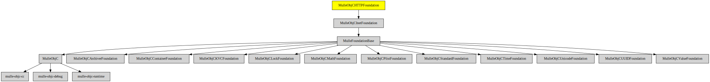

# MulleObjCHTTPFoundation

#### 🎫 HTTP and HTML utility methods and classes for mulle-objc

Adds HTTP parsing support to **NSURL** and HTML escaping and unescaping for
**NSString**.


| Release Version                                       | Release Notes  | AI Documentation
|-------------------------------------------------------|----------------|---------------
|  [](//github.com/MulleWeb/MulleObjCHTTPFoundation/actions) | [RELEASENOTES](RELEASENOTES.md) | [DeepWiki for MulleObjCHTTPFoundation](https://deepwiki.com/MulleWeb/MulleObjCHTTPFoundation)


## API

**NSString** gains these principal methods:

``` objc
- (NSString *) mulleStringByEscapingHTML;
- (NSString *) mulleStringByUnescapingHTML;
```

**NData** gains this method:

``` objc
- (NSString *) mulleHTTPDescription;
```

**NSURL** is modified to parse HTTP URLs.


### You are here




## Add

Use [mulle-sde](//github.com/mulle-sde) to add MulleObjCHTTPFoundation to your project:

``` sh
mulle-sde add github:MulleWeb/MulleObjCHTTPFoundation
```

## Install

### Install with mulle-sde

Use [mulle-sde](//github.com/mulle-sde) to build and install MulleObjCHTTPFoundation and all dependencies:

``` sh
mulle-sde install --prefix /usr/local \
   https://github.com//MulleObjCHTTPFoundation/archive/latest.tar.gz
```

### Manual Installation

Install the requirements:

| Requirements                                 | Description
|----------------------------------------------|-----------------------
| [MulleObjCInetFoundation](https://github.com/MulleWeb/MulleObjCInetFoundation)             | 📠 Internet-related classes like NSHost and NSURL for mulle-objc
| [mulle-objc-list](https://github.com/mulle-objc/mulle-objc-list)             | 📒 Lists mulle-objc runtime information contained in executables.

Download the latest [tar](https://github.com/MulleWeb/MulleObjCHTTPFoundation/archive/refs/tags/latest.tar.gz) or [zip](https://github.com/MulleWeb/MulleObjCHTTPFoundation/archive/refs/tags/latest.zip) archive and unpack it.

Install **MulleObjCHTTPFoundation** into `/usr/local` with [cmake](https://cmake.org):

``` sh
PREFIX_DIR="/usr/local"
cmake -B build                               \
      -DMULLE_SDK_PATH="${PREFIX_DIR}"       \
      -DCMAKE_INSTALL_PREFIX="${PREFIX_DIR}" \
      -DCMAKE_PREFIX_PATH="${PREFIX_DIR}"    \
       -DCMAKE_BUILD_TYPE=Release &&
cmake --build build --config Release &&
cmake --install build --config Release
```

### Platforms and Compilers

All platforms and compilers supported by
[mulle-c11](//github.com/mulle-c/mulle-c11).


## Author

[Nat!](https://mulle-kybernetik.com/weblog) for Mulle kybernetiK  

