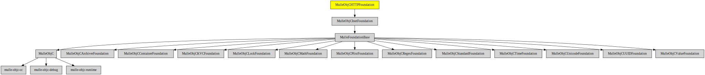

# MulleObjCHTTPFoundation

#### 🎫 HTTP and HTML utility methods and classes for mulle-objc

Adds HTTP parsing support to **NSURL** and HTML escaping and unescaping for
**NSString**.

**NSString** gains these principal methods:

```
- (NSString *) mulleStringByEscapingHTML;
- (NSString *) mulleStringByUnescapingHTML;
```

**NData** gains this method:

```
- (NSString *) mulleHTTPDescription;
```

**NSURL** is modified to parse HTTP URLs.


### You are here




## Add

Use [mulle-sde](//github.com/mulle-sde) to add MulleObjCHTTPFoundation to your project:

```
mulle-sde dependency add --c --github MulleWeb MulleObjCHTTPFoundation
```

## Install

**MulleObjCHTTPFoundation** is part of **Foundation**, see
[foundation-developer](//github.com/MulleFoundation/foundation-developer) for
installation instructions.


### Manual install

Use [mulle-sde](//github.com/mulle-sde) to build and install MulleObjCHTTPFoundation
and all its dependencies:

```
mulle-sde install --linkorder --objc --prefix /usr/local \
   https://github.com/MulleWeb/MulleObjCHTTPFoundation/archive/latest.tar.gz
```


## Acknowledgments


The HTML escaping code of this library:

```
Copyright 2008 Google Inc.

Licensed under the Apache License, Version 2.0 (the "License"); you may not
use this file except in compliance with the License.  You may obtain a copy
of the License at

http://www.apache.org/licenses/LICENSE-2.0

Unless required by applicable law or agreed to in writing, software
distributed under the License is distributed on an "AS IS" BASIS, WITHOUT
WARRANTIES OR CONDITIONS OF ANY KIND, either express or implied.  See the
License for the specific language governing permissions and limitations under
the License.
```

## Authors

[Nat!](//www.mulle-kybernetik.com/weblog) for
[Mulle kybernetiK](//www.mulle-kybernetik.com) and
[Codeon GmbH](//www.codeon.de)
